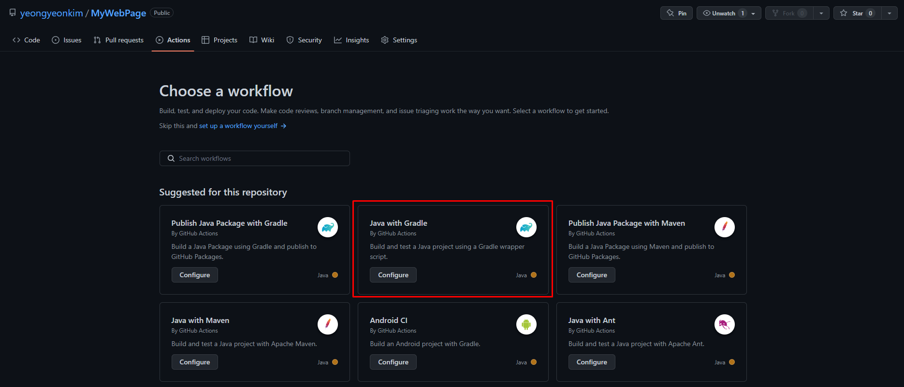
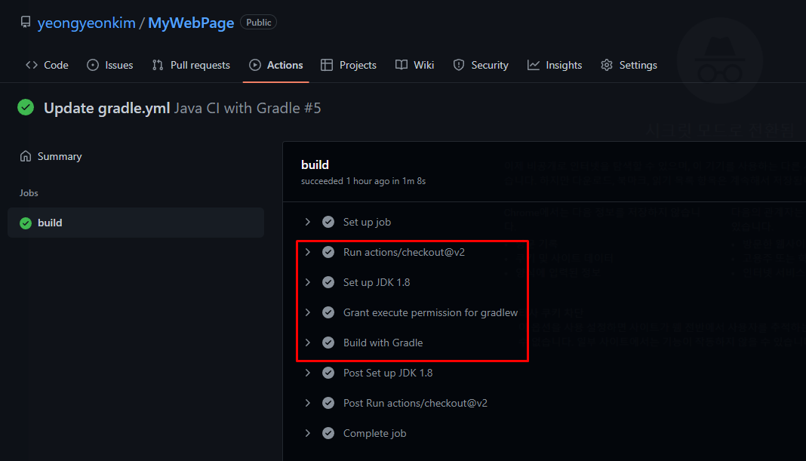
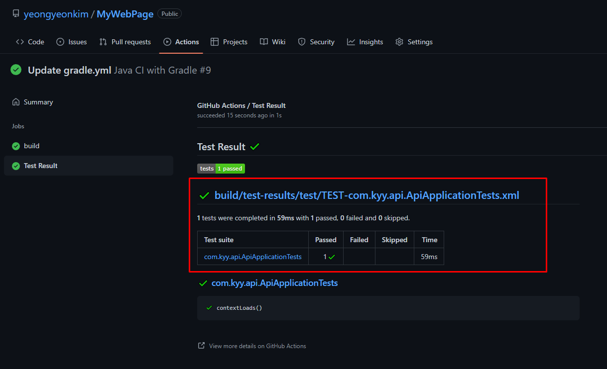
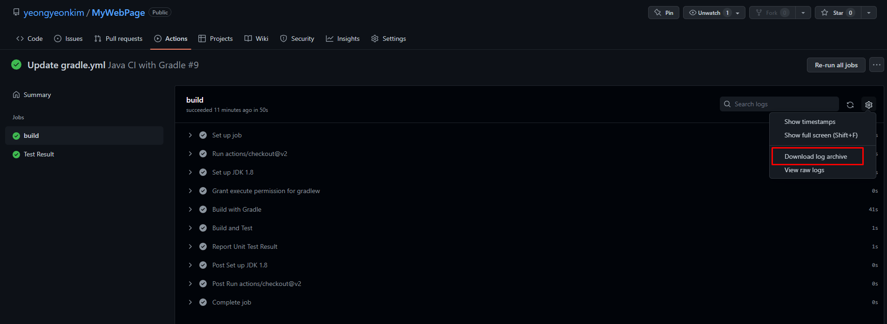
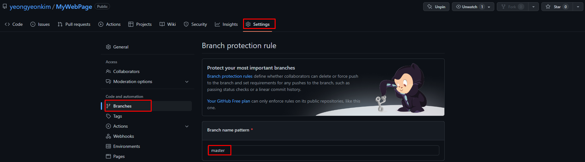
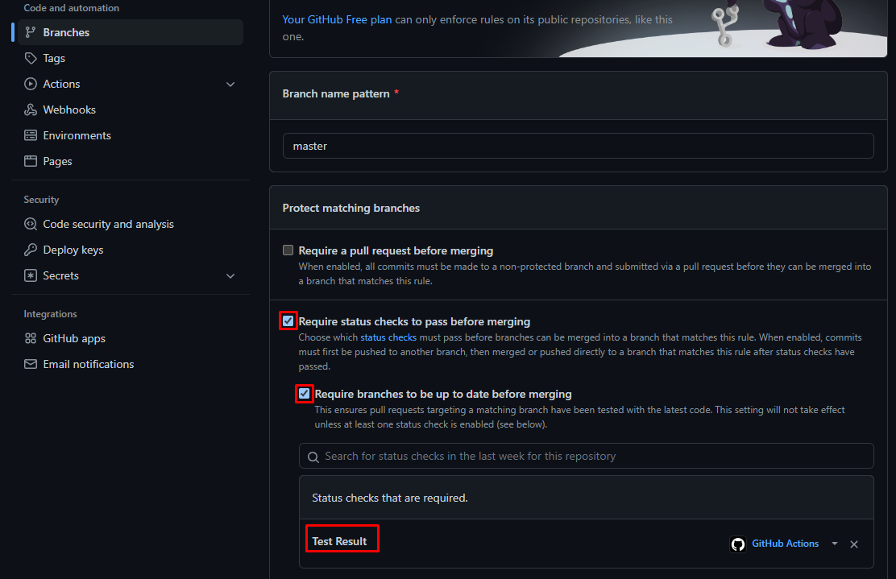

##### 목표: github actions 생성하여 push할 때 마다 CI로 빌드 & 테스트 후 S3에 적재하고 Code Deploy (ing)

- main 브랜치에 push 하면 자동으로 EC2 까지 배포되는 Workflow
  1. Github Actions 코드 빌드 및 테스트 (CI)
  2. AWS 인증
  3. jar 파일 S3 업로드
  4. Code Deploy를 통한 EC2 배포

---

##### 1. Github Actions 자동 빌드 및 테스트

* Workflow 생성



```yaml
name: Java CI with Gradle

# main 브랜치로 push 할 때 trigger 하기 위함
on:
  push:
    branches: [ "main" ]
#  pull_request:
#    branches: [ "main" ]

jobs:
  build:

    runs-on: ubuntu-latest

    steps:
    # 1) workflow 실행 전 기본적으로 checkout이 필요
    - uses: actions/checkout@v2
    
    # 2) JDK 버전 설치, 1.8을 사용하므로 설정
    - name: Set up JDK 1.8
      uses: actions/setup-java@v1
      with:
        java-version: 1.8
    # 3) Gradle wrapper 파일 실행 권한 부여
    - name: Grant execute permission for gradlew
      run: chmod +x gradlew
    # 4) Gradle 사용
    - name: Build with Gradle
      run: ./gradlew build
```



---

##### 2. JUnit Test 결과 확인 및 Report

* 빌드 테스트 및 Report를 하는 step을 각각 생성

```yaml
    - name: Build and Test
      run: ./gradlew --info test
#      with:
#         aws-access-key-id: ${{secrets.AWS_ACCESS_KEY}}
#         aws-secret-access-key: ${{secrets.AWS_SECRET_KEY}}
#         aws-region: ap-northeast-2

     # Test Result
    - name: Report Unit Test Result
      uses: dorny/test-reporter@v1
      if: always()  # success() || failure()
      with:
       name: Test Result
       path: build/test-results/**/*.xml
       reporter: java-junit
       fail-on-error: true
```

* Report 확인



* log 파일로 다운 받아서 결과를 확인 또한 가능



---

##### 3. CI가 실행 중이거나, 실패한 경우 merge가 되지 않도록 설정

* Repository - Settings - Branches - Add branch protection rule



* 병합 이전 상태를 체크, 최신 상태의 브랜치여야 한다.



---

##### 4. Github Actions 에서 사용할 IAM 사용자 생성

* Github Actions workflow에서 AWS로 접근하기 위해서는 권한이 필요하다.
* IAM 생성 - 프로그래밍 방식 액세스를 통해 access key, secret key를 발급 받는다.


* CodeDeploy 및 S3 Full Access 권한을 부여


* 이후 생성된 Access key 및 Secret Key를 Github Actions에 사용할 수 있도록 등록한다.


