### AWS 환경 구축

---

##### EC2 생성

* OS 이미지 - Amazon Linux or Ubuntu
* 키 페어 생성
* 탄력적 IP 생성 후 연결


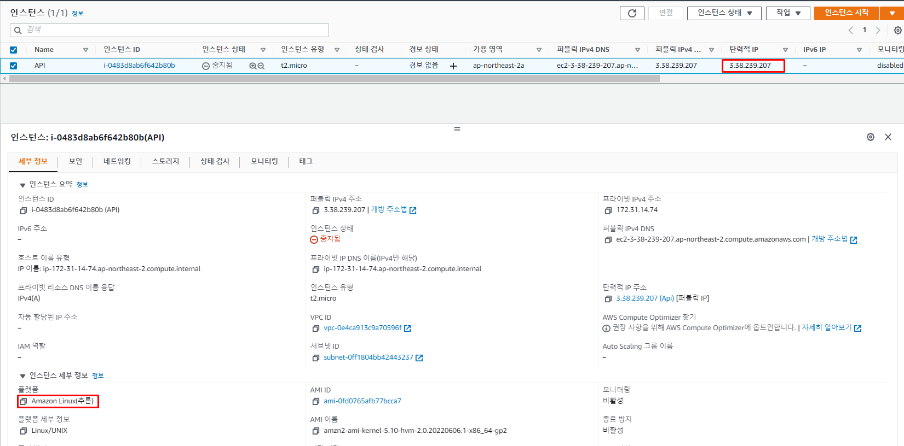

* SSH 클라이언트 서버 접속

  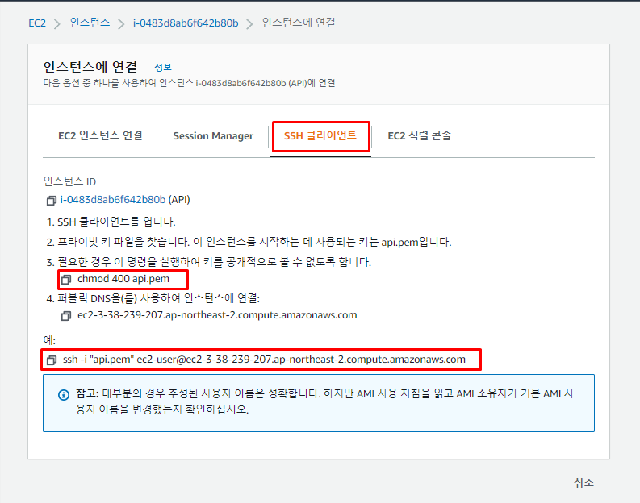

---

##### Host로 등록하여 접속 설정

1. 키 페어 파일 복사 

   * `cp api.pem ~/.ssh/`

2. 파일 권한 변경

   * `chmod 600 ~/.ssh/api.pem`

3. config 파일 생성 및 내용 입력

   * `vi ~/.ssh/config`

     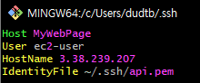

4. Hostname으로 접속

   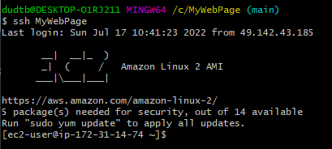

---

##### 태그 추가

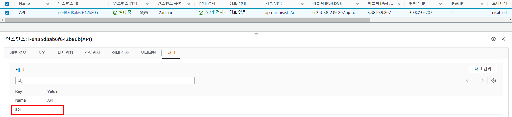

---

##### 인스턴스에 IAM 역할 설정 (S3 파일에 접근하기 위함)

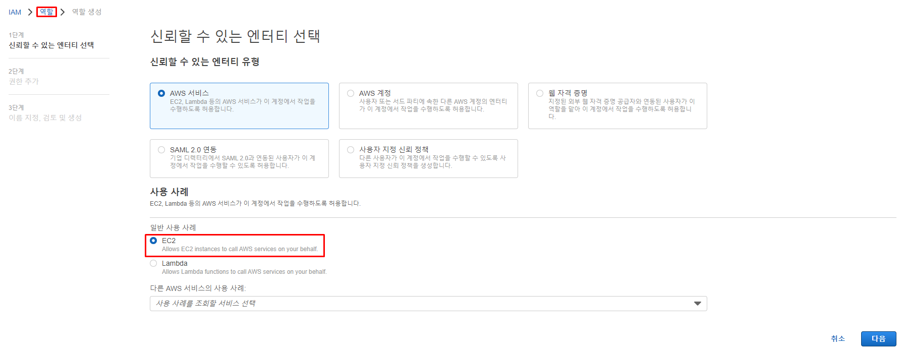

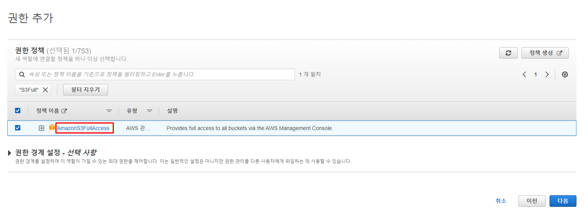

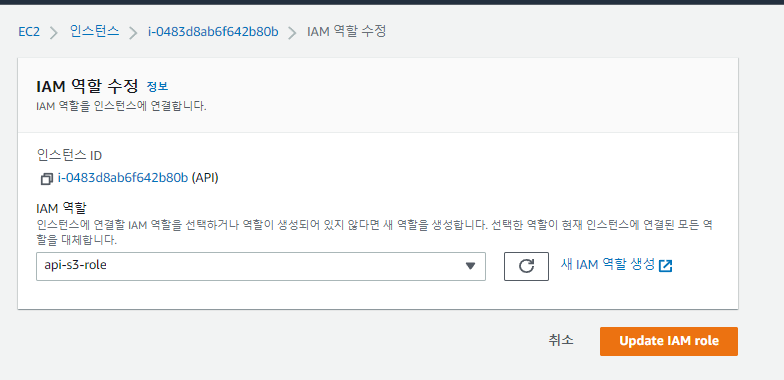

---

##### S3

* 버킷 생성 (퍼블릭 액세스를 비롯한 모든 설정 default)

  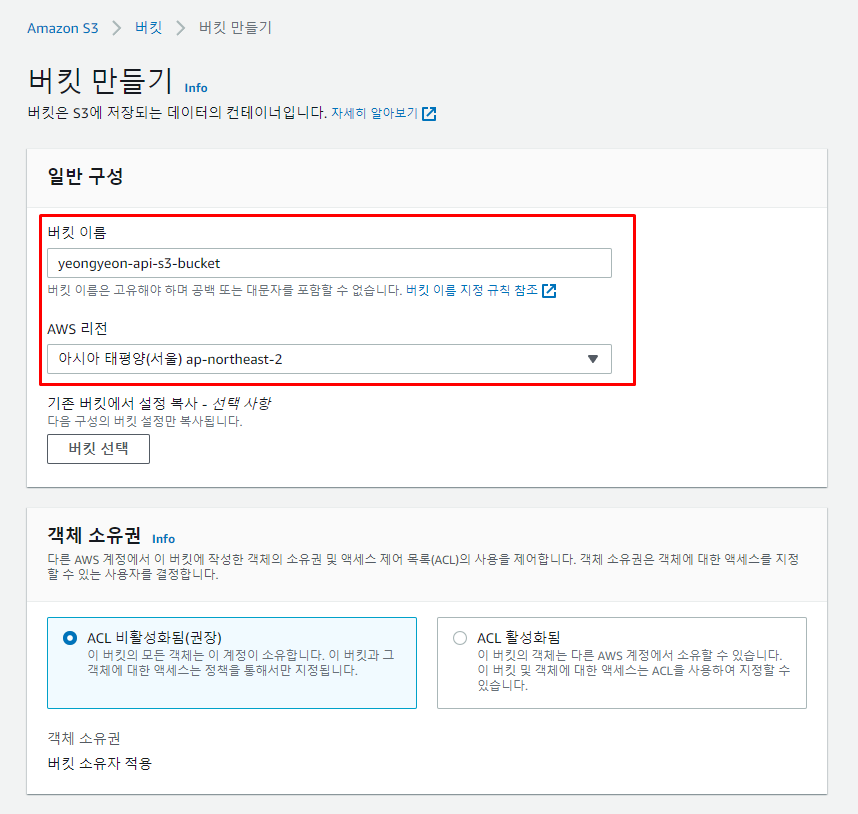

---

##### CodeDeploy Agent

* 설치 ([공식 문서](https://docs.aws.amazon.com/ko_kr/codedeploy/latest/userguide/codedeploy-agent-operations-install-linux.html))

```bash
sudo yum update -y
sudo yum install ruby -y
sudo yum install wget -y

#!/bin/bash
CODEDEPLOY_BIN="/opt/codedeploy-agent/bin/codedeploy-agent"
$CODEDEPLOY_BIN stop
yum erase codedeploy-agent -y

cd /home/ec2-user
wget https://aws-codedeploy-ap-northeast-2.s3.ap-northeast-2.amazonaws.com/latest/install
chmod +x ./install
sudo ./install auto
sudo service codedeploy-agent status
```

* CodeDeploy 역할 생성

  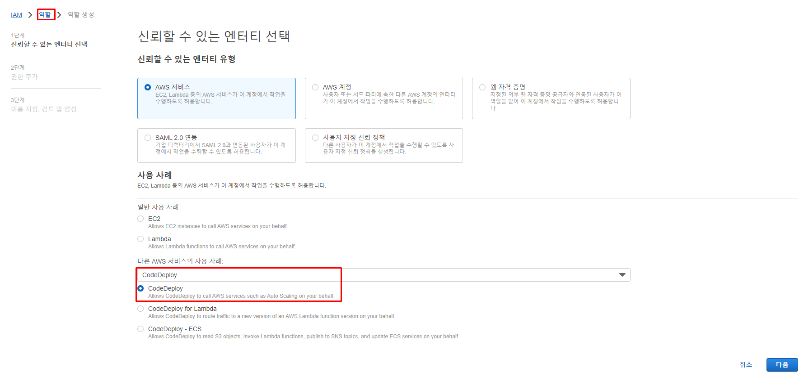

* CodeDeploy 애플리케이션 생성

  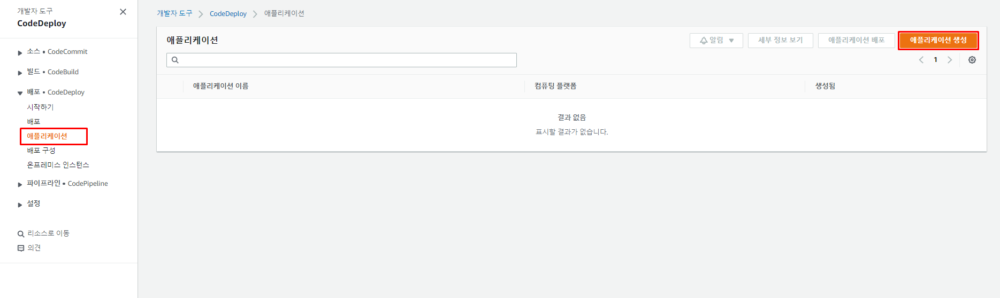

  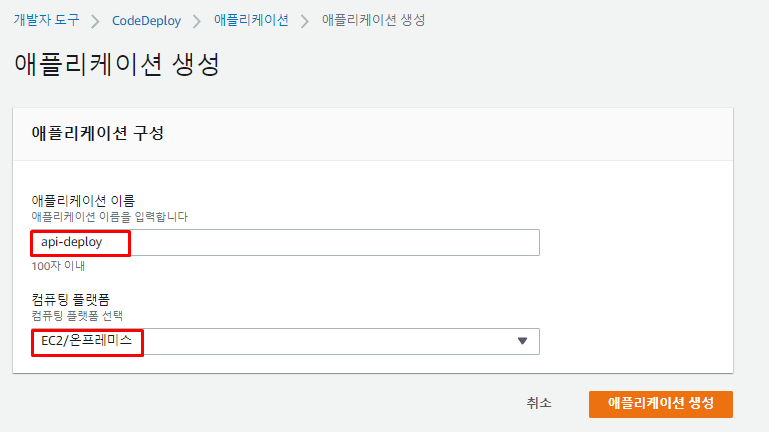

* CodeDeploy 배포 그룹 생성

  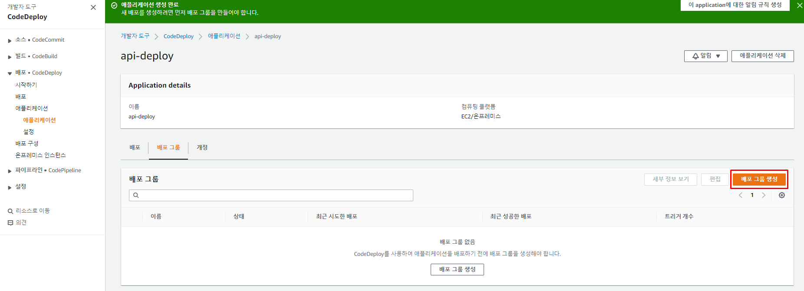

  * 생성한 iam role 적용

  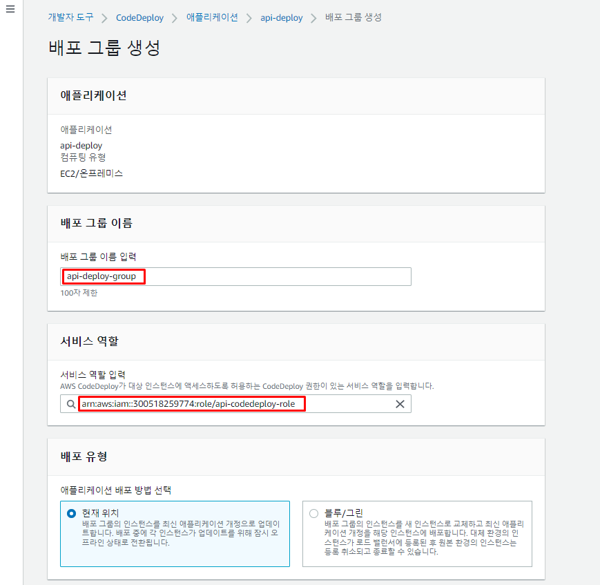

  * 대상이 될 EC2 인스턴스의 Tag 명을 기재

  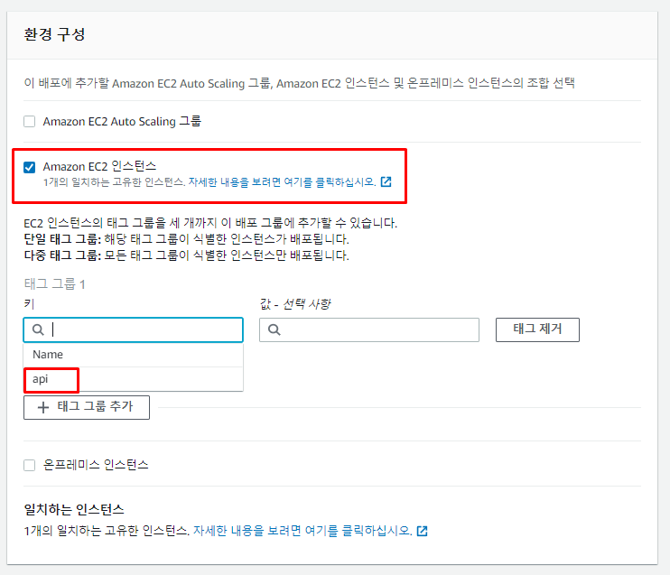

  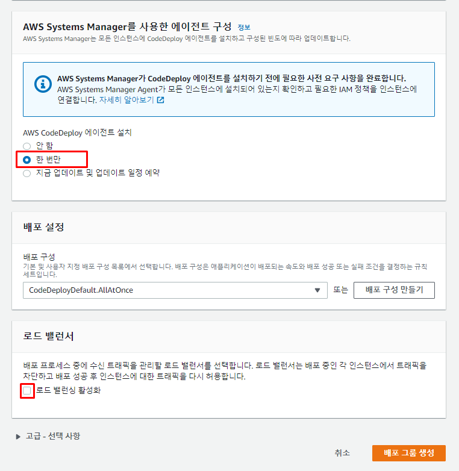

---

