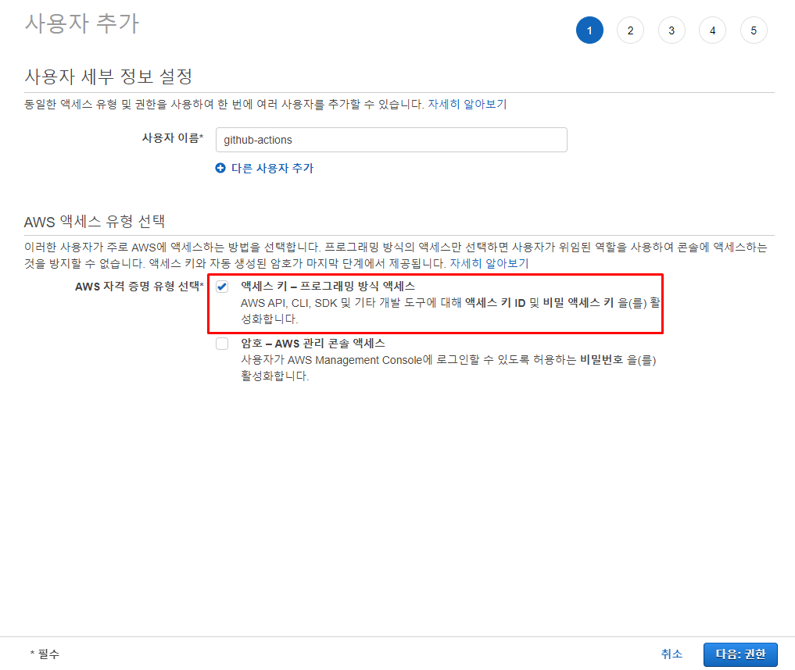
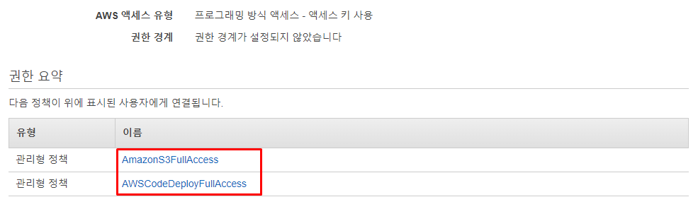
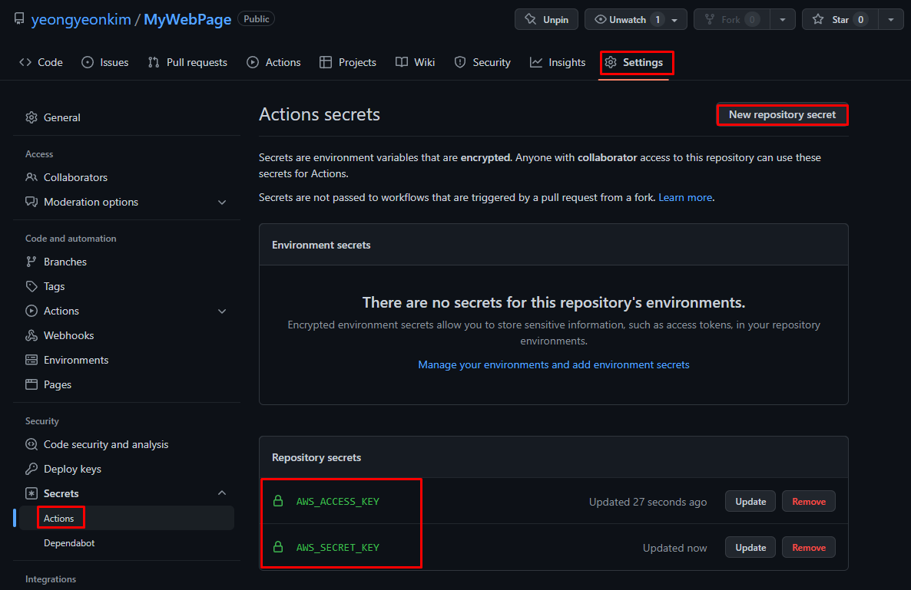

##### Github Actions 에서 사용할 IAM 사용자 생성

* Github Actions workflow에서 AWS로 접근하기 위해서는 권한이 필요하다.
* IAM 생성 - 프로그래밍 방식 액세스를 통해 access key, secret key를 발급 받는다.

* CodeDeploy 및 S3 Full Access 권한을 부여

* 이후 생성된 Access key 및 Secret Key를 Github Actions에 사용할 수 있도록 등록한다.

