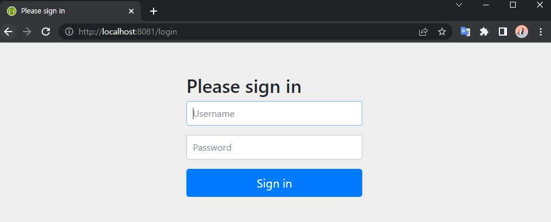
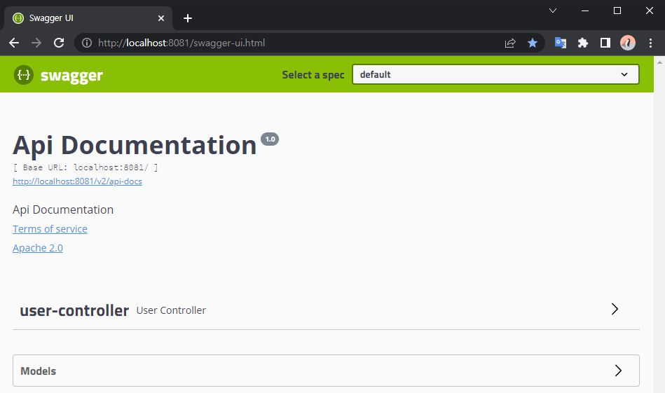
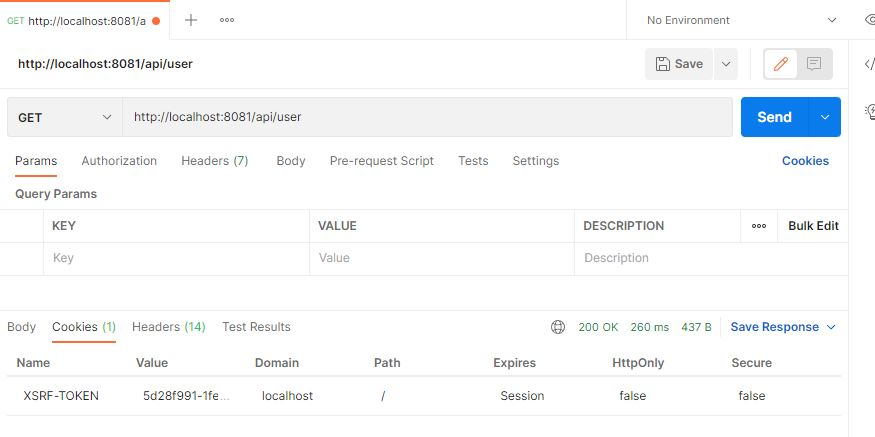
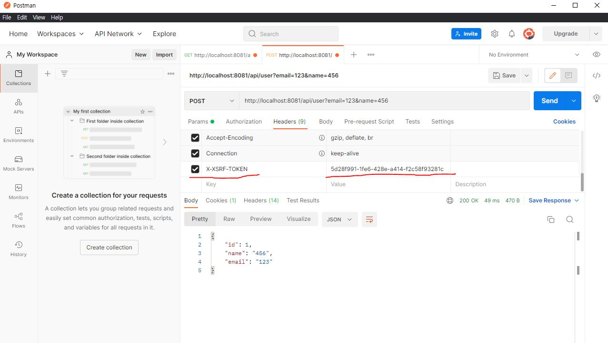

## Spring Security

* Spring Security 적용하고 나서 swagger-ui.html 접속 시도 시



* Security Config를 정의해준다. 
  * 기존에는 WebSecurityConfigurerAdapter를 상속 받아서 configure를 Override하는 방식이였지만 Spring Security 5.7.0 부터 deprecated 되었고 `SecurityFilterChain`을 빈으로 등록하는 방식을 권장하여 아래와 같이 작성하였다.

```java
@EnableWebSecurity
public class WebSecurityConfig {
    @Bean
    public SecurityFilterChain filterChain(HttpSecurity http) throws Exception {
        http
                .csrf().disable() // 하지 않으면 403 에러가 발생
                .httpBasic()
                .and()
                .authorizeRequests()
                .antMatchers("/swagger-ui.html").permitAll(); // 해당 페이지는 인증 없이 허용한다.

        return http.build();
    }
}
```

* 이후 접속



#### Rest API 에서의 CSRF

스프링 시큐리티의 어노테이션인 **@EnableWebSecurity** 어노테이션은 기본적으로 **CSRF 공격을 방지하는 기능을 지원**하고 있다.

* CSRF(Cross site request forgery)란 웹 사이트의 취약점을 이용하여 이용자가 의도하지 하지 않은 요청을 통한 공격을 의미한다.
* http 통신의 Stateless 특성을 이용하여 쿠키 정보만 이용해서 사용자가 의도하지 않은 다양한 공격들을 시도할 수 있으며, 해당 웹 사이트에 로그인한 상태로 `/logout` api를 호출하게 유도하면 실제 사용자는 의도하지 않은 로그아웃을 요청하게 된다. 실제로 로그아웃뿐만 아니라 다른 웹 호출도 가능하게 되기 때문에 보안상 위험하다.

보통 CSRF 공격의 방어는 GET을 제외한 POST, DELETE, PATCH 메서드에 적용 한다.

CSRF 공격을 방어하기 위해 대표적으로 다음과 같은 방법들이 있다.

- Referrer 검증
- Spring Security CSRF Token 사용
  - 임의의 토큰을 발급한 후 자원에 대한 변경일 경우 Token 값을 확인하는 과정을 거치는데, 만약 CSRF token이 없거나, 기존 token과 일치하지 않는 경우 **4XX 코드**를 리턴한다.

주로 `http.csrf().disable()`를 처리해주지만, 다른 방식을 구현해보았다.

* csrfTokenRepository

```java
@EnableWebSecurity
public class WebSecurityConfig {
    @Bean
    public SecurityFilterChain filterChain(HttpSecurity http) throws Exception {
        http
                .csrf().csrfTokenRepository(CookieCsrfTokenRepository.withHttpOnlyFalse())
//                .csrf().disable()
//                .httpBasic()
                .and()
                .authorizeRequests()
                .antMatchers("/swagger-ui.html").permitAll(); 

        return http.build();
    }
}
```

**CSRF 테스트**

* GET 호출
  * csrfTokenRepository 설정 후 GET 메소드를 호출하여 **쿠키 정보**를 확인



* POST 호출
  * GET 요청과 동일한 쿠키 값을 Header에 설정하면 작동한다.
    * DEFAULT_CSRF_COOKIE_NAME = "XSRF-TOKEN";
    * DEFAULT_CSRF_PARAMETER_NAME = "_csrf";
    * DEFAULT_CSRF_HEADER_NAME = "X-XSRF-TOKEN";



##### 결론

CSRF는 사이트 간 요청이 발생하기 쉬운 웹의 경우 필요하며, 이러한 애플리케이션은 보통 템플릿 엔진(Thymeleaf, JSP) 등을 사용하여 서버 측에서 전체 HTML을 생성하는 구조일 때이다.

하지만 최신의 애플리케이션은 주로 REST API의 앤드포인트에 의존하는 구조로, 대부분 JSON 방식으로 통신을 하도록 설계가 되어있다.

REST API는 HTTP 형식을 따르기 때문에 stateless 하며 서버쪽의 세션이나 브라우저 쿠키에 의존하지 않는다. 따라서 이러한 API 서버는 **CSRF 공격을 받을 가능성이 존재하지 않아 CSRF를 disable 설정**한다.